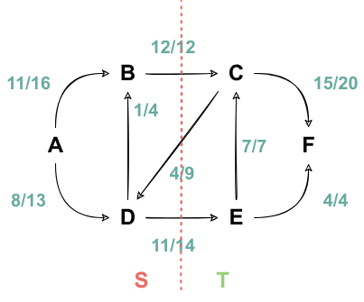
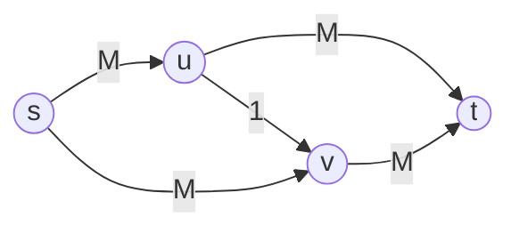
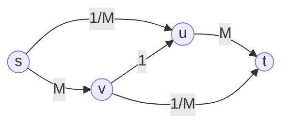
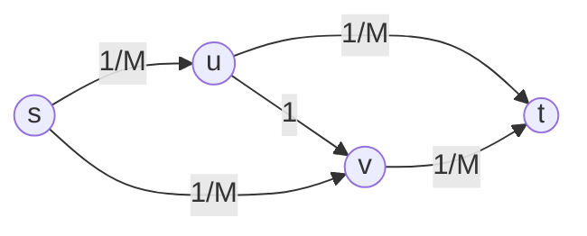
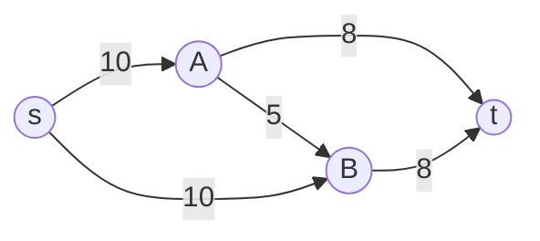
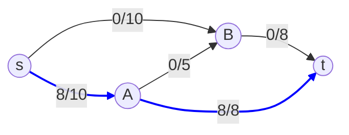
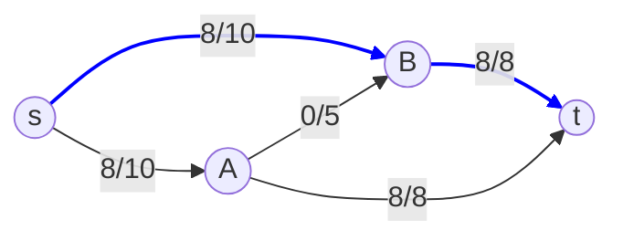
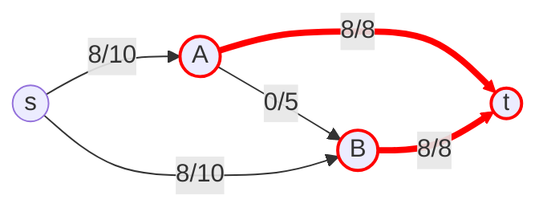
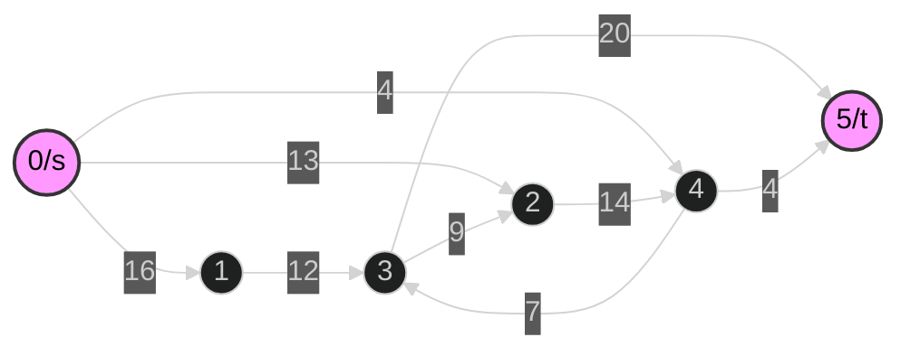

# Max Flow Research Project

# Problema do fluxo máximo

Este problema e um dos problemas mais fundamentais e exaustivamente estudados na otimização combinatória e na teoria dos grafos. Muito utilizado como base para diferentes problemas práticos, incluindo roteamento em redes de computadores, logística de transporte, agendamento de companhias áereas e até mesmo a modelagem de problemas de emparelhamento.

O problema consiste em determinar a taxa máxima na qual um objeto pode ser enviado de um ponto de origem para um ponto de destino através de uma rede de trânsito, respeitando as limitações de capacidade de cada via.

## Denifição formal de uma rede de fluxo

Uma rede de fluxo é definida como um grafo dirigido $G = (V, E)$, onde $V$ é o conjunto de vértices (nós) e $E$ é o conjunto de arestas (arcos).

Esta rede deve possuir as seguintes características:

1. **Função-capacidade**: Existe uma função $c: E \rightarrow \mathbb{R}^+$ que associa a cada aresta $(u, v) \in E$ uma capacidade não negativa $c(u, v) \ge 0$. Se uma aresta $(u, v)$ não existe, $c(u, v) = 0$. Esta capacidade representa a quantidade máxima de fluxo que pode passar pela aresta.

2. **Fonte (Source) e Sumidouro (Sink)\***: Existem dois vértices distintos designados:
   - Uma **fonte** $s \in V$, que é o ponto de origem do fluxo.
   - Um **sumidouro** $t \in V$, que é o ponto de destino final do fluxo.

## Propriedades e restrições do fluxo

Um fluxo na rede $G$ é uma função $f: V \times V \rightarrow \mathbb{R}$ que atribui um valor a cada par de vértices. Além disso, há algumas restrições:

1. **Restrições de capacidade**: O fluxo em qualquer aresta não pode exceder sua capacidade. 

   $$\forall_{u,v \in V}, 0 \le f(u,v) \le c(u,v)$$

2. **Antissimetria**: O fluxo de $u$ para $v$ deve ser o oposto do fluxo de $v$ para $u$.

   $$\forall_{u,v \in V}, f(u,v) = -f(v,u)$$

3. **Conservação de fluxo**: Para qualquer vértice $v$ que não seja a fonte $s$ ou o sumidouro $t$, o fluxo total que entra deve ser igual ao fluxo total que sai.

   $$\forall_{v \in V - \{s,t\}}, \sum_{u \in V} f(u, v) = 0$$

O **valor do fluxo**, denotado por $|f|$, é o fluxo líquido total que sai da fonte $s$, calculado como $|f| = \sum_{v \in V} f(s, v)$. O **problema do fluxo máximo** consiste em encontrar um fluxo $f$ que maximize o valor $|f|$.

# Conceitos

## Grafos residuais

O **grafo residual** $G_f = (V, E_f)$ é a representação do estado atual da rede, indicando quanta capacidade *adicional* pode ser enviada por cada aresta. Para um fluxo $f$ no grafo original $G$, a capacidade residual $c_f(u, v)$ é definida como $c_f(u, v) = c(u, v) - f(u, v)$.

A ideia central do grafo residual é a introdução de arestas de retorno (*backward edges*). Quando um fluxo de valor $x$ é enviado de $u$ para $v$ (ou seja, $f(u, v) = x$), o grafo residual $G_f$ é atualizado da seguinte forma:

1. A capacidade da aresta de avanço $(u, v)$ é diminuída: $c_f(u, v) = c(u, v) - x$.

2. Uma aresta de retorno $(v, u)$ é criada (ou tem sua capacidade aumentada) em $G_f$ com $c_f(v, u) = c_f(v, u) + x$.

A aresta de retorno $(v, u)$ representa a "permissão" para "desfazer" ou redirecionar o fluxo. Enviar fluxo pela aresta de retorno $(v, u)$ no grafo residual $G_f$ é matematicamente equivalente a diminuir o fluxo na aresta original $(u, v)$ em $G$. Esta mecânica é o que permite aos algoritmos escaparem de ótimos locais (escolhas gulosas ruins) e garantirem a otimidade global.

Um exemplo de grafo residual pode ser vista na imagem abaixo.


*Fonte: o autor.*

## Caminhos aumentantes

Um **caminho aumentante** é definido como um caminho simples da fonte $s$ até o sumidouro $t$ no grafo residual $G_f$.

A existência de um caminho aumentante significa que é possível enviar mais fluxo de $s$ para $t$. A quantidade de fluxo adicional que pode ser enviada ao longo deste caminho $p$ é limitada pela aresta com a menor capacidade residual no caminho. Esta é conhecida como a **capacidade do caminho** (gargalo).

   $$c_f(p) = \min \{ c_f(u, v) \mid (u, v) \in p \}$$

Na imagem abaixo temos um grafo residual, nele é destacado por setas azuis um caminho aumentante. A capacidade do caminho, isto é a menor capacidade residual no caminho, é 3 (na aresta $u \rightarrow v$).


*Fonte: o autor.*

O método iterativo para encontrar o fluxo máximo consiste em, repetidamente, encontrar um caminho aumentante no grafo residual e aumentar o fluxo total pelo valor $c_f(p)$ ao longo desse caminho.

# Teorema do Fluxo Máximo e Corte Mínimo

Com este teorema podemos saber quando o fluxo encontrado é o máximo possível.

## Definição de corte s-t

Um **corte s-t** (ou *$s$-$t$ cut*) é uma partição do conjunto de vértices $V$ em dois subconjuntos disjuntos, $S$ e $T=V-S$, tal que a fonte $s$ pertence a $S$ e o sumidouro $t$ pertence a $T$ ($s \in S$ e $t \in T$).

Seja $f$ um fluxo, o **fluxo líquido** de um corte corresponde a:
   $$f(S, T) = \sum_{u \in S} \sum_{v \in T} f(u, v) - \sum_{u \in S} \sum_{v \in T} f(v, u)$$

A **capacidade do corte** $c(S, T)$ é a soma das capacidades de todas as arestas que cruzam a partição na direção de $S$ para $T$:

   $$c(S, T) = \sum_{u \in S} \sum_{v \in T} c(u, v)$$

Pela imagem abaixo, temos os conjuntos $S = \{A, B, D\}$ e $T = \{C, E, F\}$. Os arcos que cruzam o corte são $(B,C)$, $(C,D)$ e $(D,F)$. Desta forma, temos que:

$$f(B, C) = 12, f(D, E) = 11, f(C, D) = 4 \implies f(S, T) = 12 + 11 - 4 = 19$$

Além disso, temos que a capacidade de corte é:

$$c(B,C)=12, c(D,E)=14 \implies c(S,T)=12+14=26$$



*Fonte: [Resumos LEIC-A](https://resumos.leic.pt/asa/fluxos-maximos/).*

O **problema do corte mínimo** (min-cut) consiste em encontrar um corte $(S, T)$ que minimize o valor de $c(S, T)$.

## O Teorema Ford-Fulkerson

O teorema, provado por *L. R. Ford Jr.* e *D. R. Fulkerson* em 1956, estabelece uma profunda dualidade entre os problemas de fluxo máximo e corte mínimo. O teorema consiste em:

1. **Lema (Dualidade Fraca)**: O valor de qualquer fluxo $f$ é sempre menor ou igual à capacidade de qualquer *corte s-t*. Ou seja, $|f| \le c(S, T)$. Segue que o fluxo total não pode ser maior que a capacidade do gargalo.

2. **Teorema (Dualidade Forte)**: O valor do fluxo máximo ($f^*$) é exatamente igual ao valor da capacidade do corte mínimo ($c^*$). Ou seja, $|f^*| = c^*$

### Implicações e a otimização

Este teorema fornece uma prova de otimalidade para os algoritmos. As três afirmações a seguir são equivalentes:

1. O fluxo $f$ é um fluxo máximo.

2. O grafo residual $G_f$ não contém caminhos aumentantes.

3. O valor do fluxo $|f|$ é igual à capacidade $c(S, T)$ de algum corte $(S, T)$, que por definição, deve ser um corte mínimo.

O algoritmo continua iterativamente procurando por caminhos aumentantes no grafo residual $G_f$ e adicionando-os ao fluxo. No momento em que a busca falha em encontrar um caminho de $s$ para $t$, o algoritmo termina. Nesse ponto, o teorema garante que o fluxo acumulado é o fluxo máximo.

# O método de Ford-Fulkerson

Este método utiliza a estratégia de caminhos aumentantes. Foi proposto no artigo seminal de 1956, "Maximal Flow throught a Network", o método foi originalmente formulado para resolver problemas práticos, como a otimização de redes ferroviárias.

## Descrição

O Ford-Fulkerson (FF) é descrito como uma abordagem "gulosa". O método geral é o seguinte:

1. Inicialize o fluxo $f(u, v) = 0$ para todas as arestas $(u, v)$. O fluxo máximo $|f_{max}|$ é 0.

2. Construa o grafo residual $G_f$ (inicialmente, $G_f$ é igual a $G$).

3. Enquanto houver um caminho aumentante $p$ de $s$ para $t$ no grafo residual $G_f$:
   - Encontre a capacidade residual do caminho:
   $$c_f(p) = \min \{ c_f(u, v) \mid (u, v) \in p \}$$

   - Aumente o fluxo total:
   $$|f_{max}| = |f_{max}| + c_f(p)$$

   - Para cada aresta $(u, v)$ em $p$, atualize o fluxo $f$ em $G$ e as capacidades em $G_f$:
     - Aumenta o fluxo: $f(u, v) = f(u, v) + c_f(p)$.
     - Antissimetria: $f(v, u) = f(v, u) - c_f(p)$.
     - Atualize $G_f$: $c_f(u, v) = c_f(u, v) - c_f(p)$ e $c_f(v, u) = c_f(v, u) + c_f(p)$.

4. Retorne $|f_{max}|$.

O passo 3 é a fonte da indeterminação do método. Uma implementação que poderia se usada é a Busca em Profundidade (DFS) para encontrar um caminho. No entanto, esta escolha arbitrária pode levar a um desempenho extremamente ruim.

## Pseudocódigo

``` pseudocódigo
Algoritmo Método_Ford-Fulkerson(Grafo G, Fonte s, Sumidouro t)
    // 1. Inicialização
    Para cada aresta (u, v) em G.arestas:
        f(u, v) = 0           // Fluxo inicial é 0
        f(v, u) = 0           // Fluxo reverso também é 0

    // 2. Construção inicial do Grafo Residual Gf
    // Gf tem os mesmos nós de G. As arestas de Gf terão a capacidade residual.
    Gf = cópia de G
    Para cada aresta (u, v) em G.arestas:
        cf(u, v) = c(u, v)    // Capacidade residual inicial é a capacidade original
        cf(v, u) = 0          // Capacidade residual reversa é 0

    f_max = 0                 // Valor do fluxo máximo inicial

    // 3. Loop Principal
    // Tenta encontrar um caminho aumentante 'p' de 's' a 't' no grafo residual 'Gf'
    Enquanto (existir um caminho p de s para t em Gf):

        // 3a. Encontra a capacidade de gargalo do caminho p
        capacidade_gargalo = INFINITO
        Para cada aresta (u, v) no caminho p:
            capacidade_gargalo = min(capacidade_gargalo, cf(u, v))

        // 3b. Aumenta o valor do fluxo total
        f_max = f_max + capacidade_gargalo

        // 3c. Atualiza os fluxos e o grafo residual
        Para cada aresta (u, v) no caminho p:
            // Aumenta o fluxo na direção do caminho
            f(u, v) = f(u, v) + capacidade_gargalo
            // Diminui o fluxo na direção oposta (antissimetria)
            f(v, u) = f(v, u) - capacidade_gargalo

            // Atualiza as capacidades residuais em Gf
            // A capacidade residual na direção do fluxo diminui
            cf(u, v) = cf(u, v) - capacidade_gargalo
            // A capacidade residual na direção reversa aumenta
            cf(v, u) = cf(v, u) + capacidade_gargalo

    // 4. Retorno
    Retorne f_max
Fim Algoritmo
```

### Análise de complexidade

Cada iteração do loop (encontrar um caminho) leva tempo proporcional ao número de arestas, ou seja, $O(E)$.

No entanto, o número de iterações depende crucialmente da escolha do caminho. Se as capacidades forem valores inteiros, o pior cenário ocorre quando o fluxo aumenta em apenas 1 unidade a cada iteração. Se o fluxo máximo tiver um valor $|f^*|$, o número de iterações pode ser da ordem de $|f^*|$.

Portanto, a complexidade de tempo do método Ford-Fulkerson é $O(E \cdot |f^*|)$.

### Complexidade de tempo pseudo-polinomial

Este tempo de execução não é polinomial. Um algoritmo é considerado polinomial se seu tempo de execução é um polinômio no tamanho da entrada (em bits). O tamanho da entrada do grafo é $O(V + E)$ mais o espaço para armazenar as capacidades, que é $O(E \log c_{max})$.O tempo $O(E \cdot |f^*|)$ é chamado de pseudo-polinomial. Ele é polinomial no valor numérico $|f^*|$, mas não no tamanho em bits (ou seja, $\log |f^*|$) da entrada.

Isso tem implicações práticas severas: se um grafo tiver capacidades muito grandes (ex: $10^9$), o algoritmo pode ser impraticavelmente lento, mesmo que o grafo em si (V e E) seja pequeno. O caso ainda pode ser pior, se as capacidades forem números irracionais, o método FF genérico pode executar um número infinito de iterações e nunca convergir para o fluxo máximo.

#### Exemplo pior caso

O grafo abaixo possui 4 vértices: uma fonte s, um sumidouro t, e dois vértices intermediários u e v. As arestas possuem as seguintes capacidades:

- As arestas $(s \rightarrow u, s \rightarrow v, u \rightarrow t, v \rightarrow t)$ possuem uma capacidade muito grande, denotada por M.

- A aresta central $(u \rightarrow v)$ atua como uma "ponte" com uma capacidade muito pequena, igual a 1.



Se o algoritmo for implementado de forma a escolher, alternadamente, os seguintes caminhos:

1. **Caminho 1**: $s \rightarrow u \rightarrow v \rightarrow t$

   - A capacidade de gargalo deste caminho é 1 (limitada pela aresta $u \rightarrow v$).

   - O fluxo total aumenta em 1.

   - No grafo residual, a aresta $u \rightarrow v$ fica saturada, e uma aresta reversa $v \rightarrow u$ com capacidade 1 é criada.



2. **Caminho 2**: $s \rightarrow v \rightarrow u \rightarrow t$

   - Este caminho utiliza a aresta reversa $v \rightarrow u$ criada na iteração anterior.

   - A capacidade de gargalo é novamente 1.

   - O fluxo total aumenta em mais 1.

   - O fluxo na aresta $u \rightarrow v$ é efetivamente "cancelado", e o sistema retorna a um estado semelhante ao inicial nas arestas de grande capacidade.


Este padrão de alternância entre os dois caminhos que utilizam a aresta central pode se repetir 2M vezes. Como cada iteração aumenta o fluxo em apenas 1 unidade, e o fluxo máximo possível é 2M, o algoritmo realizará um número de operações proporcional ao valor de M.

Se M for um número muito grande (ex: 1 milhão), o algoritmo executará milhões de iterações, tornando-se extremamente ineficiente, mesmo para um grafo com apenas 4 vértices. Isso demonstra que a complexidade do método genérico de Ford-Fulkerson é $O(E \cdot f^*)$, onde $f^*$ é o valor do fluxo máximo, caracterizando-o como um algoritmo pseudo-polinomial.

# O algoritmo de Edmonds-Karp

O problema da complexidade pseudo-polinomial foi resolvido independentemente por Yefim Dinitz em 1970  e por Jack Edmonds e Richard Karp em 1972. O algoritmo de Edmonds-Karp (EK) é uma especialização do método de Ford-Fulkerson.

## Modificação

O algoritmo de Edmonds-Karp se difere do método de Ford-Fulkerson apenas no passo 3. Nele é encontrado um caminho aumentante usando DFS, para este novo método é usado um Busca em Largura (BFS).

O uso do BFS garante que o caminho aumentante encontrado seja o mais curto em termos de número de arestas.

## Pseudocódigo


``` pseudocódigo
Algoritmo Edmonds-Karp(Grafo G, Fonte s, Sumidouro t)
    // 1. Inicialização
    // Define o fluxo inicial f(u, v) = 0 para todas as arestas
    // O grafo residual Gf é inicialmente idêntico ao grafo G original.
    Inicializar f(u, v) = 0 para todas as arestas (u, v) em G
    f_max = 0
    
    // 2. Loop Principal
    // A diferença crucial: usa BFS para encontrar o caminho mais curto em arestas
    Enquanto (BFS(Gf, s, t, caminho_pai) retorna Verdadeiro):
        
        // 2a. Encontra a capacidade de gargalo do caminho encontrado pelo BFS
        capacidade_gargalo = INFINITO
        v = t
        Enquanto (v != s):
            u = caminho_pai[v]
            capacidade_gargalo = min(capacidade_gargalo, cf(u, v))
            v = u
        
        // 2b. Aumenta o valor do fluxo total
        f_max = f_max + capacidade_gargalo
        
        // 2c. Atualiza os fluxos e o grafo residual ao longo do caminho
        v = t
        Enquanto (v != s):
            u = caminho_pai[v]
            // Aumenta o fluxo na direção do caminho
            f(u, v) = f(u, v) + capacidade_gargalo
            // Diminui o fluxo na direção oposta (antissimetria)
            f(v, u) = f(v, u) - capacidade_gargalo
            
            // Atualiza as capacidades residuais em Gf
            cf(u, v) = cf(u, v) - capacidade_gargalo
            cf(v, u) = cf(v, u) + capacidade_gargalo
            
            v = u

    // 3. Retorno
    Retorne f_max
Fim Algoritmo

// Função auxiliar BFS para encontrar o caminho mais curto
Função BFS(Grafo Residual Gf, Fonte s, Sumidouro t, Mapa caminho_pai)
    Fila q
    q.enfileirar(s)
    Conjunto visitados = {s}
    caminho_pai[s] = NULO
    
    Enquanto (q não está vazia):
        u = q.desenfileirar()
        Para cada vizinho v de u em Gf:
            // Verifica se o nó não foi visitado e se há capacidade residual
            Se (v não está em visitados E cf(u, v) > 0):
                q.enfileirar(v)
                visitados.adicionar(v)
                caminho_pai[v] = u  // Armazena o pai para reconstruir o caminho
                Se (v == t):
                    Retorne Verdadeiro // Caminho encontrado
    
    Retorne Falso // Nenhum caminho encontrado
Fim Função
```

### Análise de complexidade

A contribuição teórica de Edmonds e Karp foi provar que, ao escolher o caminho mais curto, o tempo de execução se torna fortemente polinomial, ou seja, independente do valor das capacidades. A complexidade total do algoritmo de Edmonds-Karp é $O(V \cdot E^2)$.

Essa complexidade é derivada da combinação de dois lemas:

1. **Tempo por iteração**: Cada busca por BFS para encontrar o caminho mais curto leva $O(E)$ tempo.

2. **Número de iterações**: O número total de caminhos aumentantes é, no máximo, $O(V \cdot E)$.
   - A distância do caminho mais curto da fonte $s$ para qualquer outro vértice $v$ no grafo residual, $d(s, v)$, é monotonicamente não decrescente, ou seja, nunca diminui ao longo das iterações de aumento de fluxo.

   - Cada aresta $(u, v)$ pode se tornar o gargalo no máximo $O(V)$ vezes durante toda a execução do algoritmo. Como existem $O(E)$ arestas no total, o número total de eventos de saturação (e, portanto, de augmentações) é limitado por $O(V \cdot E)$.

Este resultado é significativamente melhor que o de Ford-Fulkerson, pois depende apenas da estrutura do grafo (V e E) e não dos valores das capacidades. O algoritmo de Edmonds-Karp tem garantia de término mesmo para capacidades irracionais.

#### Exemplo

Vamos usar uma rede pequena com 4 nós:

- s: Fonte
- t: Sumidouro
- A, B: Nós intermediários
- Os números nas setas indicam a Capacidade inicial da aresta. O fluxo inicial é 0.



Estado Inicial:
- Fluxo Máximo Total: 0
- O Grafo Residual ($G_f$) é idêntico ao grafo original acima, pois não há fluxo.

Para a primera iteração:
1. Encontrar Caminho (BFS): Executamos uma BFS no grafo residual a partir de s para encontrar o caminho mais curto até t.
   - O BFS encontra dois caminhos de comprimento 2: 

      $s → A → t$ e $s → B → t$

   - Vamos escolher: Caminho $p_1$: s → A → t.
   
2. Calcular Gargalo: Verificamos as capacidades residuais nesse caminho:
   - $c_f(s, A) = 10$
   - $c_f(A, t) = 8$
   - O gargalo é o mínimo: $c_f(p_1) = 8$.

3. Aumentar Fluxo: Adicionamos 8 ao fluxo total.
   - Novo Fluxo Máximo Total: 8.

4. Atualizar Grafo Residual ($G_f$):
   - Aresta s → A: Capacidade residual diminui ($10 - 8 = 2$). Adicionamos aresta reversa A → s com capacidade 8.
   - Aresta A → t: Capacidade residual diminui ($8 - 8 = 0$). Esta aresta fica saturada e "desaparece" do residual. Adicionamos aresta reversa t → A com capacidade 8.



Para a segunda iteração:

1. Encontrar Caminho (BFS): Executamos o BFS novamente no grafo residual atualizado.
   - Como A → t não existe mais no residual, o caminho anterior não está disponível.
   - O BFS encontra o próximo caminho mais curto: Caminho $p_2$: s → B → t.
   
2. Calcular Gargalo: Verificamos as capacidades residuais nesse caminho:
   - $c_f(s, B) = 10$
   - $c_f(B, t) = 8$
   - O gargalo é o mínimo: $c_f(p_2) = 8$.

3. Aumentar Fluxo: Adicionamos 8 ao fluxo total.
   - Novo Fluxo Máximo Total: 8 + 8 = 16.

4. Atualizar Grafo Residual ($G_f$):
   - Aresta s → B: Capacidade residual diminui ($10 - 8 = 2$). Adicionamos aresta reversa B → s com capacidade 8.
   - Aresta B → t: Capacidade residual diminui ($8 - 8 = 0$). Esta aresta também fica saturada. Adicionamos aresta reversa t → B com capacidade 8.



Para a terceira iteração:

1. Encontrar Caminho (BFS): Executamos o BFS novamente.
   - Podemos ir de s para A (capacidade restante 2).
   - Podemos ir de s para B (capacidade restante 2).
   - De A, podemos ir para B (capacidade 5) ou voltar para s.
   - De B, podemos voltar para s.
   - Não há mais arestas com capacidade positiva que cheguem ao nó t.
   
2. Conclusão: O BFS não encontra nenhum caminho de s para t. O algoritmo termina.



Resultado Final:
- O algoritmo de Edmonds-Karp encontrou um Fluxo Máximo de 16.

# Comparações

Há algumas comparações que podem ser feitas, as diferenças serão colocadas na tabela abaixo:

| Característica | Método Ford-Fulkerson | Algoritmo Edmonds-Karp |
| -------------- | --------------------- | ---------------------- |
| Estratégia de Busca | Busca em Profundidade (DFS) | Busca em Largura (BFS) |
| Caminho encontrado | Qualquer caminho aumentante simples | Caminho aumentante mais curto (em nº de aresta) |
| Complexidade de tempo | $O(E \cdot \|f^*\|)$ | $O(V \cdot E^2)$ |
| Tipo de complexidade | Pseudo-polinomial | Fortemente polinomial |
| Dependências | Depende do valor das capacidades | Independente do valor das capacidades |

# Aplicação

Uma das aplicações do fluxo máximo é a resolução do problema de **emparelhamento máximo em grafos bipartidos** (*Maximum Bipartite Matching*). Este é um problema comum em alocação de recursos, como atribuir tarefas a trabalhadores, médicos a hospitais, ou motoristas a passageiros.

**O Problema**: Dado um grafo bipartido $G = (L \cup R, E)$, onde $L$ e $R$ são conjuntos disjuntos de vértices (ex: "Trabalhadores" e "Tarefas") e $E$ contém arestas apenas entre $L$ e $R$, encontrar o maior subconjunto de arestas $M \subseteq E$ tal que nenhum vértice esteja conectado a mais de uma aresta em $M$.

**A Redução para Fluxo Máximo**: O problema pode ser resolvido da seguinte forma:
- Crie uma nova super-fonte $s$ e um novo super-sumidouro $t$.
- Para cada vértice $l \in L$, adicione uma aresta $(s, l)$ com capacidade $c(s, l) = 1$.
- Para cada vértice $r \in R$, adicione uma aresta $(r, t)$ com capacidade $c(r, t) = 1$.
- Para cada aresta original $(l, r)$ no grafo bipartido, adicione uma aresta direcionada $(l, r)$ com capacidade $c(l, r) = 1$ (ou infinito; 1 é suficiente).

O Resultado: O Teorema da Integralidade garante que, como todas as capacidades são inteiras, o fluxo máximo $f^*$ encontrado pelo algoritmo de Ford-Fulkerson (ou Edmonds-Karp) também será inteiro. Como as capacidades de saída de $s$ e entrada em $t$ são 1, o fluxo em cada aresta $(l, r)$ será 0 ou 1.

O valor do fluxo máximo $|f^*|$ nesta rede construída é exatamente igual ao tamanho do emparelhamento máximo no grafo bipartido original.

## Mais aplicações

- **Roteamento em Redes**: Calcular a taxa máxima de transferência de dados entre dois pontos em uma rede de computadores.

- **Segmentação de Imagem**: Na visão computacional, o Min-Cut (e, portanto, Max-Flow) é usado para segmentar imagens, separando eficientemente o objeto de interesse do fundo.

- **Conectividade de Rede (Min-Cut)**: Pelo Teorema Max-Flow Min-Cut, o fluxo máximo é igual ao corte mínimo. Isso é usado para encontrar o número mínimo de arestas (ou cabos) que precisam ser cortados para desconectar dois pontos na rede ("Police Chase").

- **Problema de Eliminação**: Determinar se um time ainda tem chance matemática de vencer a temporada, dados os jogos restantes.

# Referências

* [1] FORD, L. R.; FULKERSON, D. R. **Maximal Flow Through a Network**. Canadian Journal of Mathematics, v. 8, p. 399-404, 1956. Disponível em: <https://www.cambridge.org/core/services/aop-cambridge-core/content/view/5D6E55D3B06C4F7B1043BC1D82D40764/S0008414X00036890a.pdf/maximal-flow-through-a-network.pdf>.
* [2] CHEN, Z.; YE, Y.; HAN, J. **A Parallel Edmonds-Karp Algorithm for Maximum Flow Problem on GPGPU**. In: INTERNATIONAL CONFERENCE ON PARALLEL AND DISTRIBUTED PROCESSING TECHNIQUES AND APPLICATIONS (PDPTA'13), 2013, Las Vegas. Proceedings... Las Vegas: CSREA Press, 2013. p. 373-379. Disponível em: <https://worldcomp-proceedings.com/proc/p2013/PDP3767.pdf>.
* [3] RESUMOS LEIC. **Fluxos Máximos**. Disponível em: <https://resumos.leic.pt/asa/fluxos-maximos/>.
* [4] MALBARBO, P. **Fluxo Máximo**. Disponível em: <https://malbarbo.pro.br/arquivos/2022/6898/10-fluxo-maximo.pdf>.
* [5] PEREIRA, F. **Algoritmo de Ford-Fulkerson para Fluxo Máximo**. 2020. 1 vídeo. Publicado pelo canal Fernando Pereira. Disponível em: <https://www.youtube.com/watch?v=Zx7Qr9WuIs8>.
* [6] FEOFILOFF, P. **Fluxo Máximo**. Disponível em: <https://www.ime.usp.br/~pf/otimizacao-combinatoria/aulas/max-flow.html#sec:flowbasics>.
* [7] IWATA, S.; KAMEYAMA, T. **A Fast Algorithm for the Maximum Flow Problem on Directed Acyclic Graphs**. Journal of the Operations Research Society of Japan, v. 47, n. 4, p. 258-267, 2004. Disponível em: <https://www.jstage.jst.go.jp/article/jorsj/47/4/47_KJ00002424949/_pdf/-char/en>.
* [8] GEEKSFORGEEKS. **Ford-Fulkerson Algorithm for Maximum Flow Problem**. Disponível em: <https://www.geeksforgeeks.org/dsa/ford-fulkerson-algorithm-for-maximum-flow-problem/>.
* [9] CP-ALGORITHMS. **Edmonds-Karp Algorithm**. Disponível em: <https://cp-algorithms.com/graph/edmonds_karp.html>.

---
\* **sumidouro (*sink*)** será tratado como destino.


