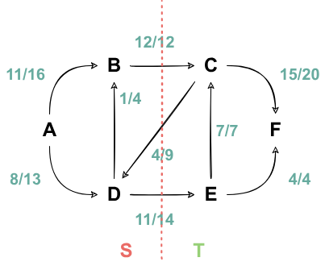

# Max Flow Research Project

# Problema do fluxo máximo

Este problema e um dos problemas mais fundamentais e exaustivamente estudados na otimização combinatória e na teoria dos grafos. Muito utilizado como base para diferentes problemas práticos, incluindo roteamento em redes de computadores, logística de transporte, agendamento de companhias áereas e até mesmo a modelagem de problemas de emparelhamento.

O problema consiste em determinar a taxa máxima na qual um objeto pode ser enviado de um ponto de origem para um ponto de destino através de uma rede de trânsito, respeitando as limitações de capacidade de cada via.

## Denifição formal de uma rede de fluxo

Uma rede de fluxo é definida como um grafo dirigido $G = (V, E)$, onde $V$ é o conjunto de vértices (nós) e $E$ é o conjunto de arestas (arcos).

Esta rede deve possuir as seguintes características:

1. **Função-capacidade**: Existe uma função $c: E \rightarrow \mathbb{R}^+$ que associa a cada aresta $(u, v) \in E$ uma capacidade não negativa $c(u, v) \ge 0$. Se uma aresta $(u, v)$ não existe, $c(u, v) = 0$. Esta capacidade representa a quantidade máxima de fluxo que pode passar pela aresta.

2. **Fonte (Source) e Sumidouro (Sink)\***: Existem dois vértices distintos designados:
   - Uma **fonte** $s \in V$, que é o ponto de origem do fluxo.
   - Um **sumidouro** $t \in V$, que é o ponto de destino final do fluxo.

## Propriedades e restrições do fluxo

Um fluxo na rede $G$ é uma função $f: V \times V \rightarrow \mathbb{R}$ que atribui um valor a cada par de vértices. Além disso, há algumas restrições:

1. **Restrições de capacidade**: O fluxo em qualquer aresta não pode exceder sua capacidade. 

   $$\forall (u,v) \in V, 0 \le f(u,v) \le c(u,v)$$

2. **Antissimetria**: O fluxo de $u$ para $v$ deve ser o oposto do fluxo de $v$ para $u$.

   $$\forall (u,v) \in V, f(u,v) = -f(v,u)$$

3. **Conservação de fluxo**: Para qualquer vértice $v$ que não seja a fonte $s$ ou o sumidouro $t$, o fluxo total que entra deve ser igual ao fluxo total que sai.

   $$\forall v \in V - \{s,t\}, \sum_{u \in V} f(u, v) = 0$$

O **valor do fluxo**, denotado por $|f|$, é o fluxo líquido total que sai da fonte $s$, calculado como $|f| = \sum_{v \in V} f(s, v)$. O **problema do fluxo máximo** consiste em encontrar um fluxo $f$ que maximize o valor $|f|$.

# Conceitos

## Grafos residuais

O **grafo residual** $G_f = (V, E_f)$ é a representação do estado atual da rede, indicando quanta capacidade *adicional* pode ser enviada por cada aresta. Para um fluxo $f$ no grafo original $G$, a capacidade residual $c_f(u, v)$ é definida como $c_f(u, v) = c(u, v) - f(u, v)$.

A ideia central do grafo residual é a introdução de arestas de retorno (*backward edges*). Quando um fluxo de valor $x$ é enviado de $u$ para $v$ (ou seja, $f(u, v) = x$), o grafo residual $G_f$ é atualizado da seguinte forma:

1. A capacidade da aresta de avanço $(u, v)$ é diminuída: $c_f(u, v) = c(u, v) - x$.

2. Uma aresta de retorno $(v, u)$ é criada (ou tem sua capacidade aumentada) em $G_f$ com $c_f(v, u) = c_f(v, u) + x$.

A aresta de retorno $(v, u)$ representa a "permissão" para "desfazer" ou redirecionar o fluxo. Enviar fluxo pela aresta de retorno $(v, u)$ no grafo residual $G_f$ é matematicamente equivalente a diminuir o fluxo na aresta original $(u, v)$ em $G$. Esta mecânica é o que permite aos algoritmos escaparem de ótimos locais (escolhas gulosas ruins) e garantirem a otimidade global.

Um exemplo de grafo residual pode ser vista na imagem abaixo.

*Fonte: o autor.*

## Caminhos aumentantes

Um **caminho aumentante** é definido como um caminho simples da fonte $s$ até o sumidouro $t$ no grafo residual $G_f$.

A existência de um caminho aumentante significa que é possível enviar mais fluxo de $s$ para $t$. A quantidade de fluxo adicional que pode ser enviada ao longo deste caminho $p$ é limitada pela aresta com a menor capacidade residual no caminho. Esta é conhecida como a **capacidade do caminho** (gargalo).

   $$c_f(p) = \min \{ c_f(u, v) \mid (u, v) \text{ pertence a } p \}$$

Na imagem abaixo temos um grafo residual, nele é destacado por setas azuis um caminho aumentante. A capacidade do caminho, isto é a menor capacidade residual no caminho, é 3 (na aresta $u \rightarrow v$).

*Fonte: o autor.*

O método iterativo para encontrar o fluxo máximo consiste em, repetidamente, encontrar um caminho aumentante no grafo residual e aumentar o fluxo total pelo valor $c_f(p)$ ao longo desse caminho.

# Teorema do Fluxo Máximo e Corte Mínimo

Com este teorema podemos saber quando o fluxo encontrado é o máximo possível.

## Definição de corte s-t

Um **corte s-t** (ou *$s$-$t$ cut*) é uma partição do conjunto de vértices $V$ em dois subconjuntos disjuntos, $S$ e $T=V-S$, tal que a fonte $s$ pertence a $S$ e o sumidouro $t$ pertence a $T$ ($s \in S$ e $t \in T$).

Seja $f$ um fluxo, o **fluxo líquido** de um corte corresponde a:
   $$f(S, T) = \sum_{u \in S} \sum_{v \in T} f(u, v) - \sum_{u \in S} \sum_{v \in T} f(v, u)$$

A **capacidade do corte** $c(S, T)$ é a soma das capacidades de todas as arestas que cruzam a partição na direção de $S$ para $T$:

   $$c(S, T) = \sum_{u \in S} \sum_{v \in T} c(u, v)$$

Pela imagem abaixo, temos os conjuntos $S = \{A, B, D\}$ e $T = \{C, E, F\}$. Os arcos que cruzam o corte são $(B,C)$, $(C,D)$ e $(D,F)$. Desta forma, temos que:

$$f(B, C) = 12, f(D, E) = 11, f(C, D) = 4 \implies f(S, T) = 12 + 11 - 4 = 19$$

Além disso, temos que a capacidade de corte é:

$$c(B,C)=12, c(D,E)=14 \implies c(S,T)=12+14=26$$

*Fonte: [Resumos LEIC-A](https://resumos.leic.pt/asa/fluxos-maximos/).*

O **problema do corte mínimo** (min-cut) consiste em encontrar um corte $(S, T)$ que minimize o valor de $c(S, T)$.

## O Teorema Ford-Fulkerson

O teorema, provado por *L. R. Ford Jr.* e *D. R. Fulkerson* em 1956, estabelece uma profunda dualidade entre os problemas de fluxo máximo e corte mínimo. O teorema consiste em:

1. **Lema (Dualidade Fraca)**: O valor de qualquer fluxo $f$ é sempre menor ou igual à capacidade de qualquer *corte s-t*. Ou seja, $|f| \le c(S, T)$. Segue que o fluxo total não pode ser maior que a capacidade do gargalo.

2. **Teorema (Dualidade Forte)**: O valor do fluxo máximo ($f^*$) é exatamente igual ao valor da capacidade do corte mínimo ($c^*$). Ou seja, $|f^*| = c^*$

### Implicações e a otimização

Este teorema fornece uma prova de otimalidade para os algoritmos. As três afirmações a seguir são equivalentes:

1. O fluxo $f$ é um fluxo máximo.

2. O grafo residual $G_f$ não contém caminhos aumentantes.

3. O valor do fluxo $|f|$ é igual à capacidade $c(S, T)$ de algum corte $(S, T)$, que por definição, deve ser um corte mínimo.

O algoritmo continua iterativamente procurando por caminhos aumentantes no grafo residual $G_f$ e adicionando-os ao fluxo. No momento em que a busca falha em encontrar um caminho de $s$ para $t$, o algoritmo termina. Nesse ponto, o teorema garante que o fluxo acumulado é o fluxo máximo.

# O método de Ford-Fulkerson

## Descrição

## Código

### Análise de complexidade

### Complexidade de tempo pseudo-polinomial

# O algoritmo de Edmonds-Karp

## Modificação

## Código

### Análise de complexidade

# Comparações

# Referências

---
\* **sumidouro (sink)** será tratado como destino.